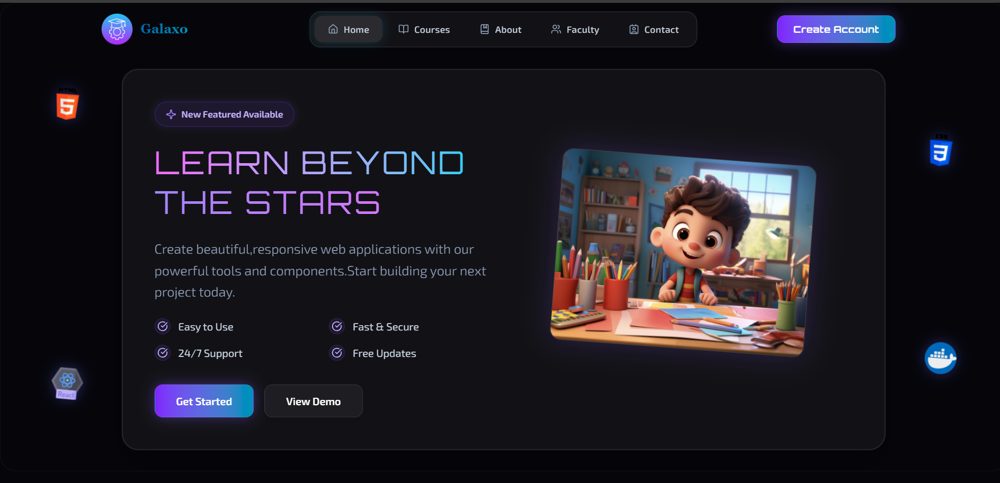

# Galaxo LMS 🎓

> A full-featured Learning Management System built with the MERN stack

[](https://galaxo.onrender.com/)
[](https://github.com/Ruusheka/Galaxo)
[]()

Galaxo is a production-ready Learning Management System designed to support the complete learning lifecycle—from course discovery to certification. Built to handle real-world challenges including payment processing, user authentication, progress tracking, and administrative analytics.

 <!-- Add your banner image -->

## 🌟 Features

### For Learners
- **📚 Course Discovery** - Browse courses with detailed descriptions and previews
- **💳 Secure Enrollment** - Enroll in free and paid courses with integrated PayPal payments
- **🎥 Flexible Learning** - Multi-source video support (YouTube, Google Drive, direct uploads)
- **📊 Progress Tracking** - Real-time completion tracking and learning milestones
- **🏆 Gamification** - Earn Gold and Legendary badges as you progress
- **📜 Instant Certificates** - Generate and download personalized certificates on completion

### For Admins
- **🛠️ Course Management** - Create, edit, and manage courses through dedicated dashboard
- **👥 User Monitoring** - Track enrollments and monitor user activity
- **💰 Revenue Analytics** - View payment insights, trends, and financial performance
- **📈 Platform Analytics** - Interactive charts for enrollment trends and performance metrics
- **🎬 Content Control** - Manage videos and course content from multiple sources

## 🚀 Tech Stack

### Frontend
- **React 19** - Modern UI library with latest features
- **Vite** - Lightning-fast build tool and dev server
- **TailwindCSS v4** - Utility-first CSS framework

### Backend
- **Node.js** - JavaScript runtime environment
- **Express 5** - Minimal and flexible web application framework
- **Mongoose** - Elegant MongoDB object modeling

### Database
- **MongoDB** - NoSQL database for flexible data storage
- **MongoDB Atlas** - Cloud-hosted database solution

### Authentication & Payments
- **Clerk** - Secure authentication and user management
- **PayPal Server SDK** - Server-side payment integration with webhooks

### Additional Tools
- **Recharts** - Data visualization library for analytics
- **Multer** - File upload middleware for video content
- **html2canvas** - Dynamic certificate generation

## 📦 Installation

### Prerequisites
- Node.js (v18 or higher)
- MongoDB Atlas account
- Clerk account (for authentication)
- PayPal developer account (for payments)

### Clone the Repository
```bash
git clone https://github.com/Ruusheka/Galaxo.git
cd Galaxo
```

### Backend Setup
```bash
cd server
npm install
```

Create a `.env` file in the `server` directory:
```env
# MongoDB
MONGODB_URI=your_mongodb_atlas_connection_string

# Clerk Authentication
CLERK_PUBLISHABLE_KEY=your_clerk_publishable_key
CLERK_SECRET_KEY=your_clerk_secret_key

# PayPal Configuration
PAYPAL_CLIENT_ID=your_paypal_client_id
PAYPAL_CLIENT_SECRET=your_paypal_client_secret
PAYPAL_MODE=sandbox  # Use 'live' for production

# Server Configuration
PORT=5000
NODE_ENV=development
CLIENT_URL=http://localhost:5173
```

Start the backend server:
```bash
npm run dev
```

### Frontend Setup
```bash
cd client
npm install
```

Create a `.env` file in the `client` directory:
```env
VITE_API_URL=http://localhost:5000
VITE_CLERK_PUBLISHABLE_KEY=your_clerk_publishable_key
```

Start the frontend development server:
```bash
npm run dev
```

The application will be available at `http://localhost:5173`

## 🏗️ Project Structure

```
galaxo/
├── client/                     # Frontend (React + Vite)
│   ├── src/
│   │   ├── components/        # Reusable UI components
│   │   │   ├── common/       # Shared components (Button, Card, etc.)
│   │   │   ├── course/       # Course-related components
│   │   │   └── dashboard/    # Dashboard components
│   │   ├── pages/            # Route pages
│   │   │   ├── Home.jsx
│   │   │   ├── Courses.jsx
│   │   │   ├── CourseDetail.jsx
│   │   │   ├── Dashboard.jsx
│   │   │   └── Admin/
│   │   ├── context/          # React context providers
│   │   ├── utils/            # Helper functions
│   │   ├── hooks/            # Custom React hooks
│   │   └── assets/           # Images, icons, styles
│   └── public/               # Static files
│
├── server/                    # Backend (Node + Express)
│   ├── models/               # Mongoose schemas
│   │   ├── User.js
│   │   ├── Course.js
│   │   ├── Enrollment.js
│   │   └── Payment.js
│   ├── routes/               # API endpoints
│   │   ├── auth.js
│   │   ├── courses.js
│   │   ├── enrollments.js
│   │   └── payments.js
│   ├── controllers/          # Business logic
│   ├── middleware/           # Auth, validation, error handling
│   ├── config/               # Configuration files
│   └── uploads/              # File upload directory
│
└── README.md
```

## 🔑 Key Features Breakdown

### 1. Authentication System
- Secure sign-up and login via Clerk
- Session management with protected routes
- Role-based access control (Learner vs Admin)
- Automatic user profile creation

### 2. Payment Integration
- Full PayPal SDK integration with server-side verification
- Support for both free and paid course enrollment
- Sandbox mode for testing, live mode for production
- Webhook handling to prevent duplicate transactions
- Complete Order → Capture → Confirmation flow

### 3. Course Management
- **Multi-source video support:**
  - YouTube video embeds
  - Google Drive video links
  - Direct file uploads
- Rich course metadata (title, description, pricing, difficulty)
- Organized curriculum structure
- Course preview functionality

### 4. Progress Tracking & Gamification
- Real-time completion percentage tracking
- Course milestone achievements
- **Badge System:**
  - 🥇 **Gold Badge** - Standard course completion
  - 🏆 **Legendary Badge** - Premium/Advanced course completion
- Learning history and activity logs

### 5. Certificate Generation
- Dynamic certificate creation using html2canvas
- Personalized with learner name, course title, and date
- Professional template with platform branding
- Instant download as high-quality image

### 6. Admin Dashboard
- **Analytics Overview:**
  - Total enrollments count
  - Revenue metrics and trends
  - Active users statistics
  - Top-performing courses
- **Visual Charts (Recharts):**
  - Enrollment trends over time
  - Revenue breakdown by course
  - User activity patterns
- **Management Interface:**
  - Create and edit courses
  - Upload and manage video content
  - Monitor user enrollments
  - Track payment transactions

## 🚧 Technical Challenges & Solutions

### Challenge 1: PayPal Integration
**Problem:**
- Business verification vs developer account verification
- Payments succeeding on frontend but failing server-side
- Understanding Orders → Capture → Confirmation workflow
- Webhook duplicate entries

**Solution:**
- Built robust server-side verification system
- Implemented webhook idempotency with transaction IDs
- Proper error handling and logging
- Separated sandbox/live environment configurations

### Challenge 2: Deployment Issues
**Problem:**
- CORS conflicts between HTTPS auth and HTTP backend
- MongoDB Atlas connection timeouts
- Missing build assets causing white screens
- Environment variable inconsistencies

**Solution:**
- Environment-specific CORS configuration
- MongoDB Atlas IP whitelist optimization
- Proper build process with asset management
- Environment variable validation system

### Challenge 3: Certificate Generation
**Problem:**
- html2canvas crashes with modern CSS (oklab, oklch)
- Inconsistent rendering across browsers

**Solution:**
- Reverted to standard color formats (hex, rgb)
- Browser compatibility testing
- Optimized canvas settings for quality vs performance

## 📊 API Documentation

### Authentication Routes
```
POST   /api/auth/register       # Register new user
POST   /api/auth/login          # Login user
GET    /api/auth/profile        # Get user profile
```

### Course Routes
```
GET    /api/courses             # Get all courses
GET    /api/courses/:id         # Get course by ID
POST   /api/courses             # Create course (Admin)
PUT    /api/courses/:id         # Update course (Admin)
DELETE /api/courses/:id         # Delete course (Admin)
```

### Enrollment Routes
```
POST   /api/enrollments         # Enroll in course
GET    /api/enrollments/user    # Get user enrollments
PUT    /api/enrollments/:id     # Update progress
```

### Payment Routes
```
POST   /api/payments/create     # Create PayPal order
POST   /api/payments/capture    # Capture payment
POST   /api/payments/webhook    # PayPal webhook handler
```

## 🔒 Security Features

- **Authentication:** Secure session management with Clerk
- **Payment Verification:** Server-side PayPal verification
- **Protected Routes:** Authentication middleware on all sensitive endpoints
- **CORS Configuration:** Environment-specific allowed origins
- **Route Guards:** Content protection for paid courses
- **Environment Variables:** Sensitive data stored securely
- **Input Validation:** Request validation on all API endpoints

## ⚠️ Current Limitations

1. **Payment Mode:** PayPal is currently in SANDBOX mode. Real payments are disabled. Use free courses to explore the platform.

2. **Video Storage:** Direct uploads stored on server. For production scale, migrate to cloud storage (AWS S3, Cloudinary).

3. **Email Notifications:** Not yet implemented. Planned for future release.

4. **Mobile App:** Web-only platform. Native mobile apps planned for future development.

## 🔮 Future Enhancements

- [ ] Email notifications for enrollments and certificates
- [ ] Course reviews and ratings system
- [ ] Discussion forums for learner interaction
- [ ] Quiz and assessment features
- [ ] Mobile applications (React Native)
- [ ] Advanced analytics with AI-powered insights
- [ ] Multi-language support (i18n)
- [ ] Live streaming for real-time classes
- [ ] Subscription plans for unlimited access
- [ ] Instructor dashboard for third-party course creators
- [ ] Social learning features (study groups, peer reviews)
- [ ] Offline mode with progressive web app (PWA)

## 📈 Performance Optimizations

- Vite for fast build times and hot module replacement
- Code splitting for optimized bundle sizes
- MongoDB indexing for faster queries
- Image optimization for certificates
- Lazy loading for course videos
- React Context API for efficient state management

## 🤝 Contributing

Contributions are welcome! Please follow these steps:

1. Fork the repository
2. Create a feature branch (`git checkout -b feature/AmazingFeature`)
3. Commit your changes (`git commit -m 'Add some AmazingFeature'`)
4. Push to the branch (`git push origin feature/AmazingFeature`)
5. Open a Pull Request

## 📝 License

This project is licensed under the MIT License - see the [LICENSE](LICENSE) file for details.

## 👤 Author

**Ruusheka Akilavarshini**

## ⭐ Show Your Support

Give a ⭐️ if this project helped you learn something new!

---

**Note:** This project was built as a learning experience to understand real-world challenges in full-stack development, payment integration, and deployment. PayPal is currently in sandbox mode for demonstration purposes.

**Live Demo:** [https://galaxo.onrender.com/](https://galaxo.onrender.com/)

**Project Status:** 🚧 Active Development
